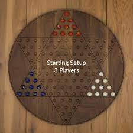

# Chinese Checkers

## Players
- 2, 3, 4, or 6

## Setup
- Hexagram shaped board - each point of the hexagram is a triangle that contains 10 marbles in a unique colour 
- For 2, 4 or 6 players: Players take triangles on opposite sides of the board
- For 3 players: Players take 3 triangles equidistant from each other on the board 

- The triangle that your marbles occupy at the start of the game is your "home" 

## Objective
- Move all 10 of your marbles into the "target" - the triangle directly opposite your "home"

## Rules
- Players take turns moving a single marble of their colour
- On your turn a marble can be moved into any adjacent unoccupied spot OR "hop" over another marble that is directly adjacent
- You can hop over marbles of any colour, not just your own 
- The marble can make several hops in one turn, as long as there are marbles directly adjacent for it to hop over  
- Once a marble is in the target triangle, it cannot make a hop outside - it can temporarily hop outside but must end up back in the target at the end of the turn